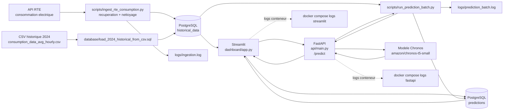
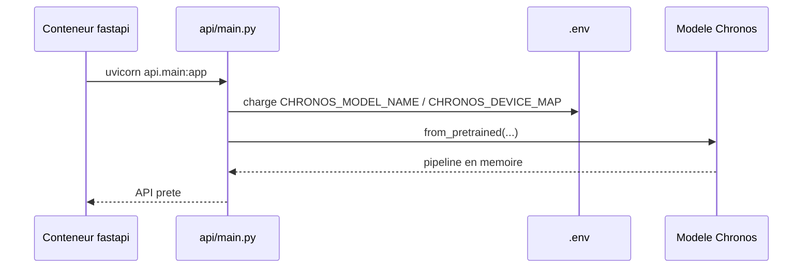
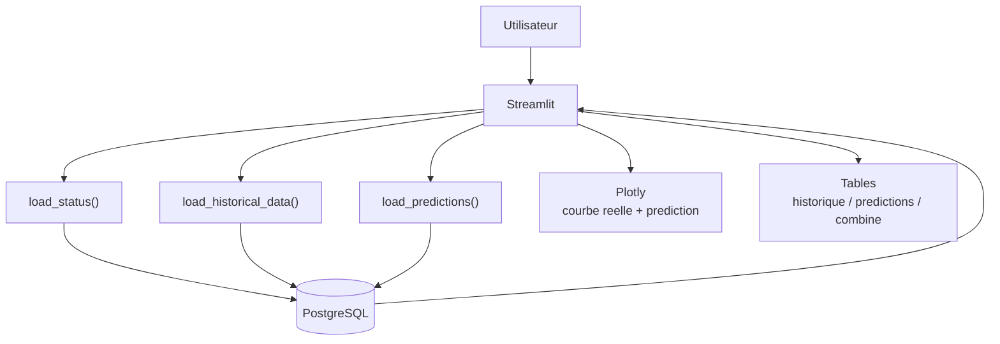
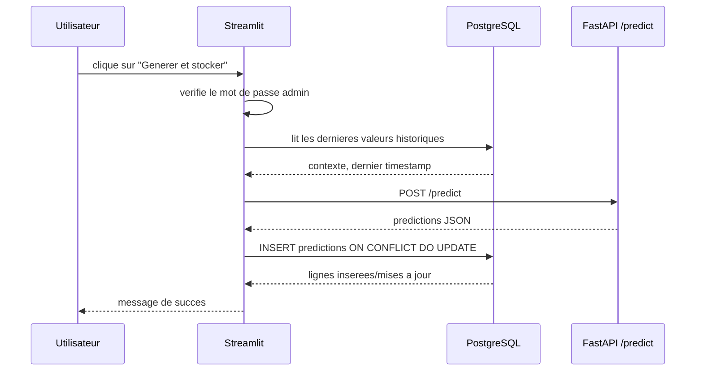
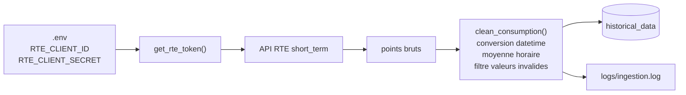
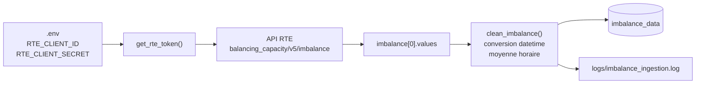
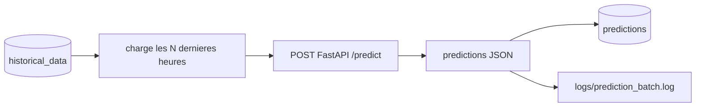
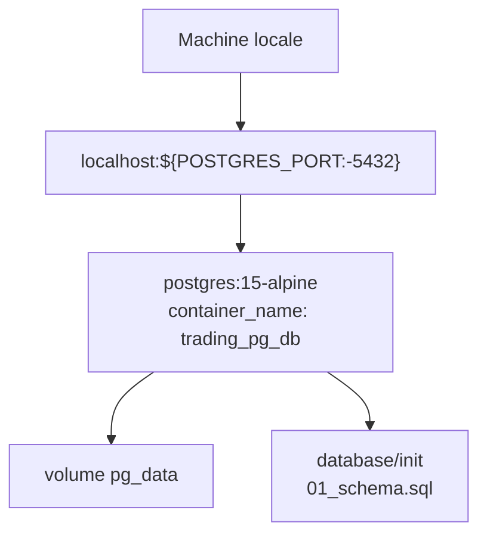
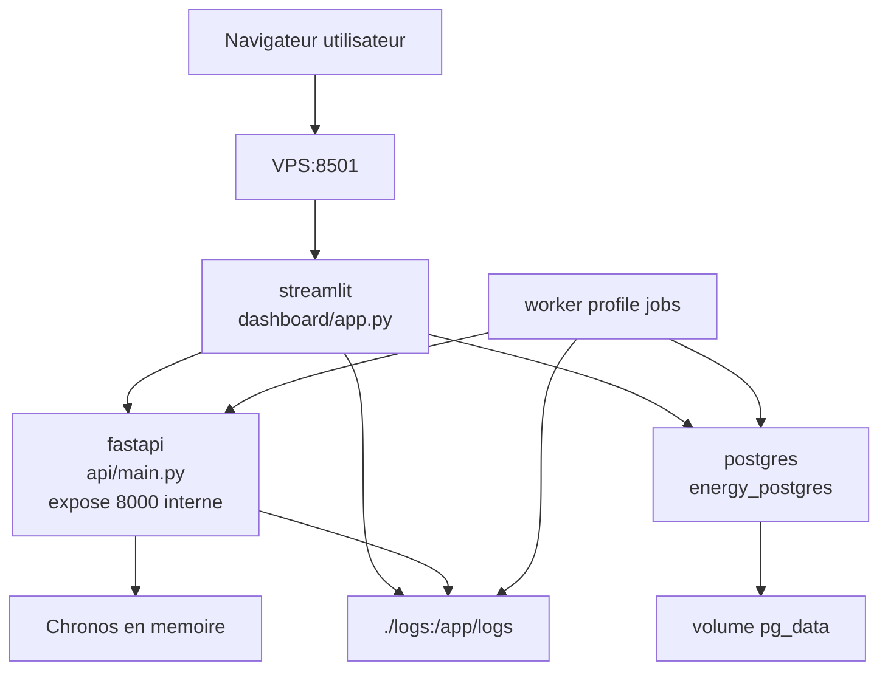

# Architecture du projet Energy Forecast

Ce document sert de carte mentale du projet. Il explique comment les donnees
circulent entre l'API, le dashboard, Docker, PostgreSQL, les scripts batch et
les logs.

## 1. Vue d'ensemble

Le projet predit la consommation electrique a partir de donnees historiques RTE.
Il est compose de quatre blocs principaux :

- PostgreSQL stocke les donnees historiques et les predictions.
- FastAPI charge le modele Chronos et expose une API HTTP de prediction.
- Streamlit affiche les donnees, les graphiques et peut declencher une prediction.
- Les scripts batch automatisent l'ingestion RTE et la generation de predictions.

Schema global :



Idee centrale a retenir :

```text
RTE/CSV -> historical_data -> contexte recent -> FastAPI /predict -> predictions -> dashboard
```

## 2. Structure des dossiers

```text
.
|-- api/
|   |-- main.py                         # API FastAPI + modele Chronos
|-- dashboard/
|   |-- app.py                          # Point d'entree Streamlit
|   |-- settings.py                     # Configuration des pages/datasets
|   |-- database.py                     # Acces PostgreSQL commun
|   |-- prediction_client.py            # Client HTTP vers FastAPI /predict
|   |-- views/
|   |   |-- shared.py                   # Composants communs aux pages
|   |   |-- consumption.py              # Page consommation
|   |   |-- imbalance.py                # Page imbalance
|-- database/
|   |-- init/01_schema.sql              # Creation initiale des tables
|   |-- migrations/02_predictions_unique_key.sql
|   |-- load_2024_historical_from_csv.sql
|-- docs/
|   |-- ARCHITECTURE.md                 # Ce document
|-- logs/
|   |-- ingestion.log                   # Logs du script RTE
|   |-- prediction_batch.log            # Logs du batch prediction
|-- scripts/
|   |-- ingest_rte_consumption.py       # Ingestion automatique depuis RTE
|   |-- ingest_rte_imbalance.py         # Ingestion imbalance depuis RTE
|   |-- run_prediction_batch.py         # Prediction batch + insertion DB
|   |-- test_prediction_api.py          # Test direct de /predict depuis CSV
|-- docker-compose.yml                  # Local: PostgreSQL seulement
|-- docker-compose.vps.yml              # VPS: PostgreSQL + FastAPI + Streamlit + worker
|-- Dockerfile                          # Image Python commune API/dashboard/worker
|-- requirements.txt                    # Dependances Python
|-- .env                                # Configuration locale privee
|-- .env.example                        # Exemple de configuration
```

## 3. Base de donnees PostgreSQL

La base est initialisee par `database/init/01_schema.sql` quand le volume
PostgreSQL est cree pour la premiere fois.

### Table `historical_data`

Role : stocker les valeurs reelles de consommation electrique.

Colonnes :

| Colonne | Type | Role |
|---|---:|---|
| `id` | `BIGSERIAL` | Identifiant technique |
| `timestamp` | `TIMESTAMPTZ` | Date/heure de la mesure |
| `value` | `DOUBLE PRECISION` | Consommation en MW |
| `source` | `TEXT` | Source de la donnee, par defaut `RTE` |
| `import_date` | `TIMESTAMPTZ` | Date d'insertion ou mise a jour |

Contrainte importante :

```sql
UNIQUE (timestamp, source)
```

Cela empeche de dupliquer une meme mesure RTE pour la meme heure. Si une
ingestion est relancee, la ligne est mise a jour avec `ON CONFLICT`.

### Table `predictions`

Role : stocker les valeurs predites par Chronos.

Colonnes :

| Colonne | Type | Role |
|---|---:|---|
| `id` | `BIGSERIAL` | Identifiant technique |
| `timestamp` | `TIMESTAMPTZ` | Date/heure predite |
| `predicted_value` | `DOUBLE PRECISION` | Consommation predite |
| `model_name` | `TEXT` | Modele utilise, ex. `amazon/chronos-t5-small` |
| `horizon` | `TEXT` | Horizon, ex. `H+1`, `H+24` |
| `prediction_date` | `TIMESTAMPTZ` | Date de generation |

Contrainte importante :

```sql
UNIQUE (timestamp, model_name, horizon)
```

Cela permet de relancer une prediction sans creer de doublons. La valeur est
mise a jour si la meme prediction existe deja.

## 4. API FastAPI

Fichier principal : `api/main.py`.

Role : transformer le modele Chronos en service HTTP.

Au demarrage :

1. Le fichier `.env` est charge.
2. `CHRONOS_MODEL_NAME` est lu, par defaut `amazon/chronos-t5-small`.
3. `CHRONOS_DEVICE_MAP` est lu, par defaut `cpu`.
4. FastAPI execute le `lifespan`.
5. Le modele Chronos est charge en memoire avec `from_pretrained`.

Schema du demarrage :



### Endpoint `GET /health`

Role : verifier que l'API tourne et que le modele est charge.

Reponse typique :

```json
{
  "status": "ok",
  "model_name": "amazon/chronos-t5-small",
  "model_loaded": true,
  "device_map": "cpu"
}
```

### Endpoint `POST /predict`

Role : recevoir un contexte historique et renvoyer des predictions.

Requete :

```json
{
  "context": [48000.0, 48210.0, 49100.0, 50000.0],
  "prediction_length": 24,
  "quantiles": [0.1, 0.5, 0.9]
}
```

Validation :

- `context` doit contenir au moins 4 valeurs.
- Les valeurs du contexte peuvent etre positives ou negatives, mais doivent etre finies.
- `prediction_length` doit etre entre 1 et 168.
- Les quantiles doivent etre strictement entre 0 et 1.

Traitement interne :

1. Le contexte est converti en tenseur PyTorch.
2. Chronos genere plusieurs echantillons de forecast.
3. NumPy calcule les quantiles demandes.
4. La prediction principale est `q50` si disponible, sinon la moyenne.
5. L'API retourne une liste de points `step`, `predicted_value`, `quantiles`.

Important : l'API ne se connecte pas a PostgreSQL. Elle ne fait que calculer et
retourner une reponse JSON. L'insertion en base est faite par Streamlit ou par
le script batch.

## 5. Dashboard Streamlit

Fichier principal : `dashboard/app.py`.

Role : interface utilisateur pour lire les donnees, visualiser les courbes et
generer manuellement des predictions.

Le dashboard est organise par pages fonctionnelles. Une configuration
`DatasetConfig` decrit pour chaque page :

- le titre affiche ;
- la table des donnees reelles ;
- la table des predictions ;
- les libelles du graphe et des metriques ;
- la colonne d'affichage dans la vue combinee.

Pages actuellement prevues :

| Page | Table reelle | Table predictions | Role |
|---|---|---|---|
| `Consommation` | `historical_data` | `predictions` | Consommation electrique RTE |
| `Imbalance` | `imbalance_data` | `imbalance_predictions` | Donnees d'imbalance et predictions Chronos |

Pour ajouter un autre type de donnees plus tard, il faut creer les tables SQL
equivalentes puis ajouter une entree dans `DATASETS`.

Organisation du code dashboard :

```text
dashboard/app.py
-> choisit la page dans la sidebar
-> appelle dashboard/views/consumption.py ou dashboard/views/imbalance.py
-> les pages utilisent dashboard/views/shared.py pour les filtres, metriques, graphes
-> shared.py utilise dashboard/database.py et dashboard/prediction_client.py
```

Au lancement :

1. Le fichier `.env` est charge.
2. Streamlit configure la page.
3. Le dashboard se connecte a PostgreSQL.
4. Il lit les statistiques globales.
5. Il affiche les filtres, les metriques, le graphique et les tables.

Flux de lecture :



Flux de generation manuelle :



Protection :

- Le bouton de prediction est desactive si `DASHBOARD_ADMIN_PASSWORD` n'est pas defini.
- L'utilisateur doit entrer le mot de passe admin dans la sidebar.
- En VPS, FastAPI n'est pas exposee publiquement : Streamlit l'appelle par le
  reseau Docker interne avec `http://fastapi:8000/predict`.

## 6. Scripts batch

Les scripts servent a automatiser les taches hors interface.

### `scripts/ingest_rte_consumption.py`

Role : recuperer les donnees recentes RTE et les inserer dans `historical_data`.

Flux :



Points importants :

- Si aucune date n'est fournie, le script prend les dernieres heures completes.
- Les donnees RTE sont regroupees par heure avec une moyenne.
- `--min-points-per-hour` permet d'eviter de garder une heure incomplete.
- `--dry-run` permet de tester sans insertion.
- Les inserts utilisent `ON CONFLICT (timestamp, source) DO UPDATE`.

Commandes utiles :

```powershell
py scripts/ingest_rte_consumption.py --hours 24 --dry-run
py scripts/ingest_rte_consumption.py --hours 24
```

### `scripts/ingest_rte_imbalance.py`

Role : recuperer les donnees d'imbalance RTE depuis l'endpoint
`balancing_capacity/v5/imbalance` et les inserer dans `imbalance_data`.

Flux :



Points importants :

- Les valeurs d'imbalance peuvent etre positives ou negatives.
- Le script lit `response.json()["imbalance"][0]["values"]`.
- Chaque point brut doit contenir `start_date` et `value`.
- Les donnees sont ramenees au format commun `timestamp`, `value`, `source`.
- `source` vaut `RTE_IMBALANCE`.

Commandes utiles :

```powershell
py scripts/ingest_rte_imbalance.py --start-date 2020-01-01T00:00:00+00:00 --end-date 2020-01-03T00:00:00+00:00 --dry-run
py scripts/ingest_rte_imbalance.py --hours 24
```

### `scripts/run_prediction_batch.py`

Role : lancer une prediction sans passer par le bouton Streamlit.

Flux :



Points importants :

- Le script lit les dernieres valeurs de `historical_data`.
- Il appelle FastAPI, par defaut `http://localhost:8000/predict`.
- En Docker VPS, il faut utiliser `http://fastapi:8000/predict`.
- Il insere dans `predictions` avec anti-doublon.
- `--dry-run` appelle l'API mais n'insere rien.

Commandes utiles :

```powershell
py scripts/run_prediction_batch.py --context-length 168 --prediction-length 24 --dry-run
py scripts/run_prediction_batch.py --context-length 168 --prediction-length 24
```

### `scripts/test_prediction_api.py`

Role : tester l'API rapidement avec un CSV.

Ce script ne touche pas a PostgreSQL. Il lit un CSV, construit un contexte, appelle
`/predict`, puis affiche la reponse JSON.

## 7. Docker

Il y a deux modes Docker.

### Local : `docker-compose.yml`

Ce fichier lance uniquement PostgreSQL.



Utilisation typique :

```powershell
docker compose up -d
py -m uvicorn api.main:app --reload --host 127.0.0.1 --port 8000
py -m streamlit run dashboard/app.py
```

Dans ce mode :

- PostgreSQL tourne dans Docker.
- FastAPI tourne sur la machine locale.
- Streamlit tourne sur la machine locale.
- `POSTGRES_HOST=localhost` dans `.env`.
- `PREDICTION_API_URL=http://localhost:8000/predict`.

### VPS : `docker-compose.vps.yml`

Ce fichier lance toute l'application.



Services :

| Service | Role | Port |
|---|---|---:|
| `postgres` | Base de donnees | interne Docker |
| `fastapi` | API Chronos | `8000` expose seulement aux autres conteneurs |
| `streamlit` | Dashboard web | `8501` public sur le VPS |
| `worker` | Execution ponctuelle des scripts | profil `jobs` |

Pourquoi FastAPI n'est pas exposee publiquement :

- Le modele peut etre couteux a appeler.
- Le dashboard est le point d'entree utilisateur.
- Les appels internes Docker utilisent le nom de service `fastapi`.

Commandes VPS utiles :

```powershell
docker compose -f docker-compose.vps.yml up -d --build
docker compose -f docker-compose.vps.yml ps
docker compose -f docker-compose.vps.yml logs -f fastapi
docker compose -f docker-compose.vps.yml logs -f streamlit
```

Pour lancer un script dans le conteneur worker :

```powershell
docker compose -f docker-compose.vps.yml run --rm worker python scripts/ingest_rte_consumption.py --hours 24
docker compose -f docker-compose.vps.yml run --rm worker python scripts/run_prediction_batch.py --api-url http://fastapi:8000/predict
```

## 8. Image Docker

Fichier : `Dockerfile`.

Role : construire une image Python commune pour FastAPI, Streamlit et worker.

Etapes :

1. Base `python:3.12-slim`.
2. Variables Python :
   - `PYTHONDONTWRITEBYTECODE=1` evite les fichiers `.pyc`.
   - `PYTHONUNBUFFERED=1` affiche les logs sans buffering.
3. Dossier de travail `/app`.
4. Installation de `pip`.
5. Installation des dependances depuis `requirements.txt`.
6. Copie du projet dans l'image.

La meme image est reutilisee avec des commandes differentes :

```text
fastapi   -> uvicorn api.main:app ...
streamlit -> streamlit run dashboard/app.py ...
worker    -> python scripts/...
```

## 9. Configuration `.env`

Variables principales :

| Variable | Utilisee par | Role |
|---|---|---|
| `POSTGRES_DB` | tous les modules DB | Nom de la base |
| `POSTGRES_USER` | tous les modules DB | Utilisateur PostgreSQL |
| `POSTGRES_PASSWORD` | tous les modules DB | Mot de passe PostgreSQL |
| `POSTGRES_PORT` | local | Port PostgreSQL expose |
| `POSTGRES_HOST` | dashboard, scripts | `localhost` en local, `postgres` en Docker |
| `RTE_CLIENT_ID` | ingestion | Identifiant API RTE |
| `RTE_CLIENT_SECRET` | ingestion | Secret API RTE |
| `CHRONOS_MODEL_NAME` | FastAPI | Modele de forecast |
| `CHRONOS_DEVICE_MAP` | FastAPI | `cpu` ou configuration GPU |
| `PREDICTION_API_URL` | dashboard, scripts | URL de `/predict` |
| `DASHBOARD_ADMIN_PASSWORD` | dashboard | Autorise la generation manuelle |

Difference importante :

```text
Local:
POSTGRES_HOST=localhost
PREDICTION_API_URL=http://localhost:8000/predict

Docker VPS:
POSTGRES_HOST=postgres
PREDICTION_API_URL=http://fastapi:8000/predict
```

## 10. Logs

Il y a deux types de logs.

### Logs applicatifs fichiers

Ces logs sont ecrits par les scripts Python dans le dossier `logs/`.

| Fichier | Produit par | Contenu |
|---|---|---|
| `logs/ingestion.log` | `scripts/ingest_rte_consumption.py` | Dates interrogees, nombre de points RTE, lignes inserees |
| `logs/imbalance_ingestion.log` | `scripts/ingest_rte_imbalance.py` | Dates interrogees, points imbalance, lignes inserees |
| `logs/prediction_batch.log` | `scripts/run_prediction_batch.py` | Contexte charge, appel API, nombre de predictions inserees |

Dans Docker VPS, `./logs:/app/logs` rend ces fichiers persistants sur le serveur.

### Logs conteneurs Docker

FastAPI et Streamlit ecrivent surtout dans la sortie standard du conteneur.

Commandes :

```powershell
docker compose -f docker-compose.vps.yml logs -f fastapi
docker compose -f docker-compose.vps.yml logs -f streamlit
docker compose -f docker-compose.vps.yml logs -f postgres
```

Ce qu'on y cherche :

- `fastapi` : chargement du modele, erreurs `/predict`, erreurs Uvicorn.
- `streamlit` : erreurs de connexion PostgreSQL, erreurs d'appel API.
- `postgres` : erreurs SQL, probleme d'initialisation, healthcheck.

### Logs cron

Si les scripts sont lances par cron, le README propose aussi des redirections :

```text
logs/cron_ingestion.log
logs/cron_prediction.log
```

Ces fichiers capturent la sortie complete de la commande cron, en plus des logs
internes `ingestion.log` et `prediction_batch.log`.

## 11. Cycle de vie complet des donnees

### Etape A: remplir l'historique

Deux possibilites :

1. Import CSV historique avec `database/load_2024_historical_from_csv.sql`.
2. Ingestion RTE recente avec `scripts/ingest_rte_consumption.py`.

Resultat : la table `historical_data` contient une serie temporelle horaire.

### Etape B: generer une prediction

Deux possibilites :

1. Depuis le dashboard Streamlit avec le bouton admin.
2. Depuis le batch `scripts/run_prediction_batch.py`.

Dans les deux cas :

```text
Lire N heures dans historical_data
-> envoyer context a FastAPI /predict
-> recevoir H predictions
-> inserer dans predictions
```

### Etape C: visualiser

Le dashboard lit :

- `historical_data` pour la courbe reelle.
- `predictions` pour la courbe predite.

Puis Plotly affiche les deux series sur le meme graphique.

## 12. Points de controle pour debugger

### PostgreSQL ne demarre pas

Verifier :

```powershell
docker compose ps
docker compose logs postgres
```

Causes possibles :

- Mot de passe manquant dans `.env`.
- Volume deja initialise avec une ancienne configuration.
- Port `5432` deja utilise en local.

### Le dashboard ne lit aucune donnee

Verifier :

```sql
SELECT COUNT(*), MIN(timestamp), MAX(timestamp) FROM historical_data;
SELECT COUNT(*), MIN(timestamp), MAX(timestamp) FROM predictions;
```

Causes possibles :

- Import CSV non lance.
- Ingestion RTE sans identifiants valides.
- Mauvais `POSTGRES_HOST`.
- Filtres de dates Streamlit hors periode disponible.

### La prediction ne marche pas

Verifier FastAPI :

```powershell
curl http://localhost:8000/health
```

En Docker VPS :

```powershell
docker compose -f docker-compose.vps.yml exec fastapi python -c "import requests; print(requests.get('http://localhost:8000/health').json())"
```

Causes possibles :

- Modele Chronos pas encore charge.
- RAM insuffisante.
- `PREDICTION_API_URL` incorrect.
- Pas assez de donnees historiques pour le contexte demande.

### Les predictions se dupliquent

Normalement elles ne doivent pas se dupliquer grace a :

```sql
UNIQUE (timestamp, model_name, horizon)
```

Si le probleme revient, verifier que la migration
`database/migrations/02_predictions_unique_key.sql` a bien ete appliquee sur la
base concernee.

## 13. Resume ultra-court

- `database/init/01_schema.sql` cree les tables.
- `scripts/ingest_rte_consumption.py` remplit `historical_data`.
- `api/main.py` charge Chronos et predit via `/predict`.
- `dashboard/app.py` affiche les donnees et peut appeler `/predict`.
- `scripts/run_prediction_batch.py` automatise la prediction.
- `docker-compose.yml` sert au local avec PostgreSQL seul.
- `docker-compose.vps.yml` sert au VPS avec toute la stack.
- `logs/ingestion.log` et `logs/prediction_batch.log` gardent l'historique des jobs.
